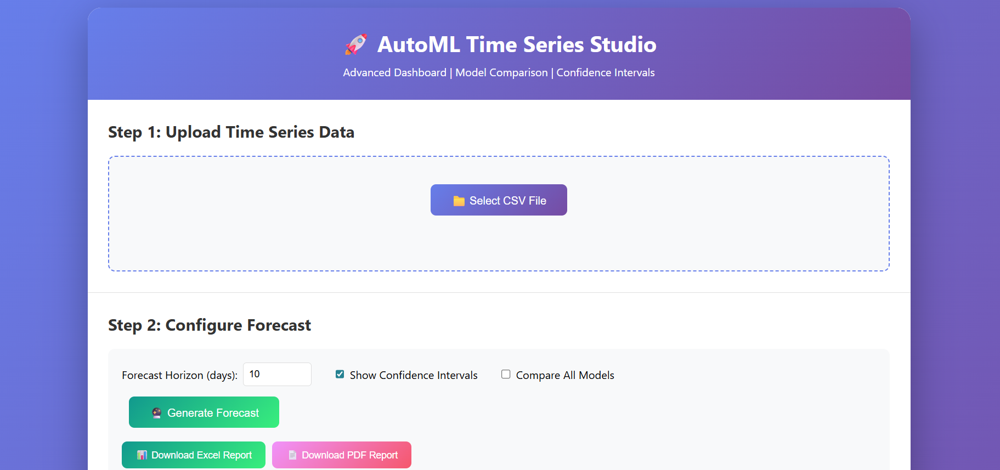
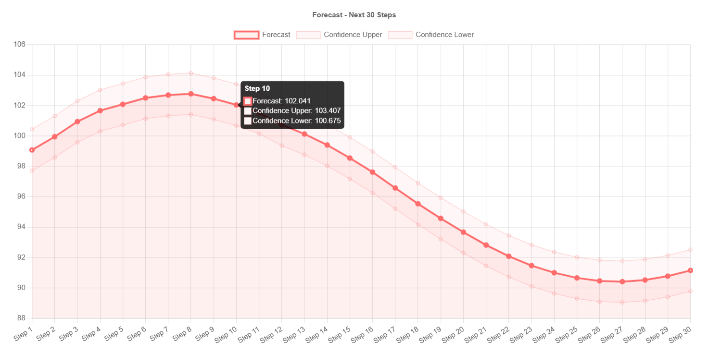
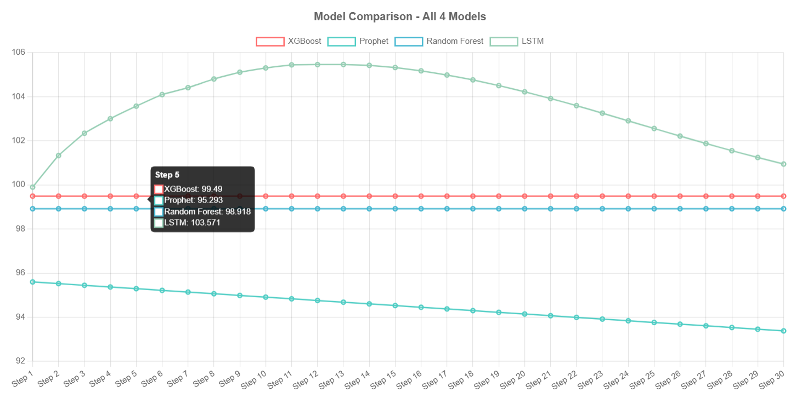
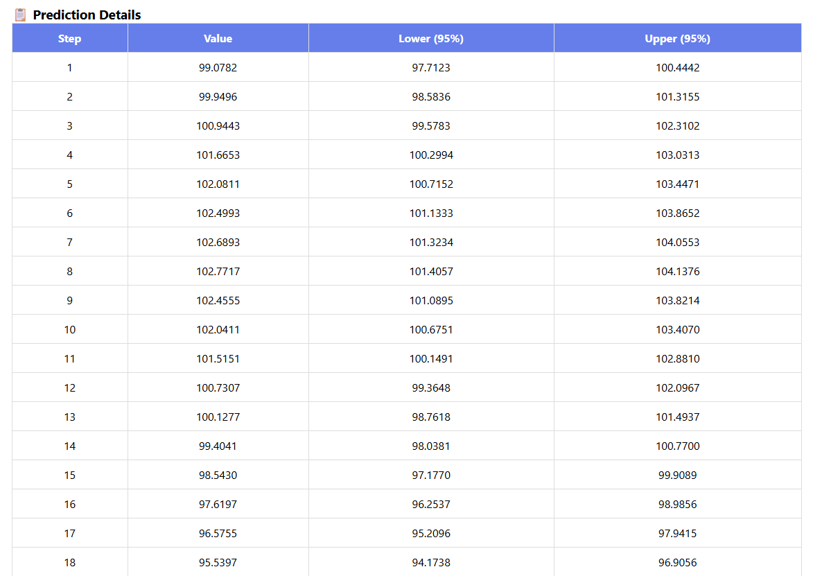

# 🚀 AutoML Time Series Studio

[](https://python.org)
[](https://fastapi.tiangolo.com)
[](https://tensorflow.org)
[](https://github.com/YOUR_USERNAME/AutoML_TS_Studio/actions/workflows/test.yml)
[](https://codecov.io/gh/YOUR_USERNAME/AutoML_TS_Studio)
[](LICENSE)

An intelligent web-based tool for automatic time series forecasting. Upload your CSV, and the system automatically selects the best model (XGBoost/Prophet/RandomForest/LSTM) and generates forecasts with confidence intervals.

## ✨ Features

- **🤖 AutoML Model Selection** - Automatically chooses optimal model based on data characteristics
- **📊 4 Models in One** - XGBoost, Prophet, RandomForest, and LSTM
- **📈 Model Comparison** - Compare all 4 models simultaneously
- **📉 Confidence Intervals** - 95% prediction intervals for forecasts
- **💾 Model Persistence** - Save and load trained models
- **📤 Export to Excel** - Download forecasts and historical data
- **🎨 Interactive Dashboard** - Clean, responsive web interface
- **🧪 Unit Tests** - Comprehensive test coverage

## 🛠️ Tech Stack

### Backend
- **FastAPI** - High-performance web framework
- **TensorFlow/Keras** - LSTM deep learning
- **XGBoost** - Gradient boosting
- **Prophet** - Seasonal forecasting
- **Scikit-learn** - Random Forest & preprocessing

### Frontend
- **HTML5/CSS3** - Modern responsive design
- **JavaScript** - Interactive charts
- **Chart.js** - Data visualization

### Testing & DevOps
- **Pytest** - Unit and integration tests
- **Docker** - Containerization (optional)

## 📦 Installation

### Local Setup

```bash
# Clone repository
git clone https://github.com/YOUR_USERNAME/AutoML_TS_Studio.git
cd AutoML_TS_Studio

# Create virtual environment
python -m venv .venv

# Activate virtual environment
# Windows:
.venv\Scripts\activate
# Mac/Linux:
source .venv/bin/activate

# Install dependencies
pip install -r requirements.txt

# Run the application
python -m backend.app
```

## Docker Setup (Alternative)

```bash
# Build and run with Docker Compose
docker-compose up --build
```

## 🎯 Usage

### Step 1: Upload CSV
Your CSV must contain at least two columns (date and value). Example:

```csv

date,value
2024-01-01,100
2024-01-02,102
2024-01-03,105
```

### Step 2: Configure Forecast
- Set forecast horizon (1-365 days)
- Optionally enable confidence intervals
- Optionally compare all 4 models

### Step 3: Generate Forecast
Click "Generate Forecast" and view:

- Interactive forecast chart
- Model selection explanation
- Prediction table with confidence intervals
- Model comparison (if enabled)

## 🤖 AutoML Decision Rules

Data Size	Model Selected

< 30 points	XGBoost (fast, accurate for small data)

30-50 points	Random Forest (balanced performance)

≥ 50 points	LSTM (deep learning for patterns)

Seasonal data	Prophet (explicit seasonality)

## 📊 Dashboard Features

### Tab 1: Forecast Chart
- Main forecast visualization
- 95% confidence interval band
- Interactive tooltips

### Tab 2: Model Comparison
- Compare all 4 models simultaneously
- See which model performs better
- Color-coded lines for clarity

### Tab 3: Historical + Forecast
- View historical data alongside predictions
- Understand the trend continuation

## 📤 Export

Excel export includes:
- Historical data sheet
- Forecast predictions sheet
- Model summary sheet

## 🧪 Running Tests

```bash
# Run all tests
pytest

# Run unit tests only
pytest tests/unit/ -v

# Run with coverage report
pytest --cov=backend --cov-report=html
```

## 📁 Project Structure

```text
AutoML_TS_Studio/
├── backend/
│   ├── automl/          # ML models and AutoML logic
│   │   ├── base_models.py    # XGBoost, Prophet, RF, LSTM
│   │   ├── model_selector.py # AutoML decision logic
│   │   ├── trainer.py        # Training pipeline
│   │   └── persistence.py    # Save/load models
│   ├── preprocessing/   # Data cleaning and scaling
│   ├── routes/          # API endpoints
│   │   ├── upload.py    # CSV upload
│   │   ├── forecast.py  # Prediction endpoint
│   │   └── export.py    # Excel download
│   └── app.py           # FastAPI main application
├── frontend/
│   ├── css/             # Styling
│   ├── js/              # Frontend logic
│   └── index.html       # Main dashboard
├── tests/               # Unit and integration tests
├── requirements.txt     # Python dependencies
└── README.md
```
## 📸 Screenshots

### Main Dashboard


### Forecast with Confidence Intervals


### Model Comparison (All 4 Models)


### Predictions Table


## 📈 Example Output

### After uploading a CSV with 100 data points, the system:
- Detects 100 points → selects LSTM
- Trains LSTM model (50 epochs, lookback=15)
- Generates forecast for next 20 steps
- Displays interactive chart with confidence intervals

## 🔧 Troubleshooting

### TensorFlow compatibility issues
```bash
pip install typing-extensions==4.5.0 --force-reinstall
```

### Prophet installation on Windows
```bash
pip install cmdstanpy==1.2.0
pip install prophet==1.1.5
```

## Chart.js not loading

The app includes multiple CDN fallbacks and a text-based fallback for offline use.

## 🤝 Contributing

Pull requests are welcome! For major changes, please open an issue first.

## 📝 License

MIT License - feel free to use and modify!

## 🌟 Star History

If you find this project useful, please give it a star ⭐

## 📧 Contact

Mehrshad Mahmoudi - m.mahmoudi20633@gmail.com